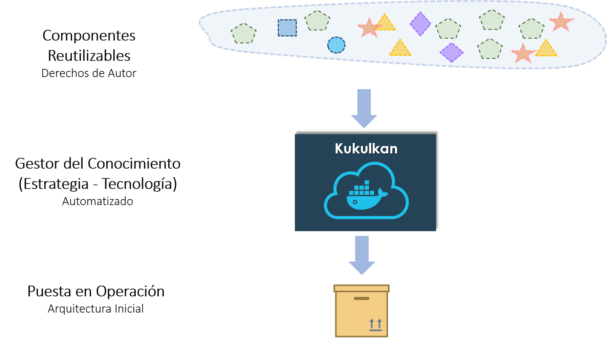

author: Kukulkan Team
summary: Demo para utlizar Kukulkan
id: demo-kukulkan
categories: documentation
environments: js
status: draft
analytics account: 0

# Introducción a Kukulkan

## Definición


## Modelo de Reutilización



## Modelo de Distribución - Shell


## Modelo de Distribución - IDE


## Herramientas para Reutilizar


## KDM mínimo


## Componentes

## Tecnología Soportada


## Capas Generadas


## Creación de un proyecto

```shell
create-project --app-name demodsl --database-type SQL_MYSQL --packaging com.example
```

## Adición de entidades a partir de la definición de una base de datos

```shell
add-entities-from-database --source SQL_MYSQL

[Se proporcionan las credenciales para la conexión a la base de datos]

```

## Adición de entidades a partir de la definición de entidades utilizando el Lenguaje Kukulkan

```java
// Nombre del archivo: model.3k
// Se crea la entidad persona con 'usuarios' como nombre de la tabla en la base de datos
entity Persona (usuarios) {
    -> nombre : String required min(3) max(50),
    edad : Integer min(5) max(120) required,
    sueldo : Long,
    impuesto : Float,
    activo : Boolean,
    fechaCreacion : LocalDate,
    foto : ImageBlob,
    ManyToOne manager : Persona,
    ManyToMany proyectos : Proyecto,
    OneToMany retardos : Retardo,
    OneToOne user: CoreUser
}

entity Proyecto {
    nombre : String required,
    descripcion : String
}

entity Retardo {
    descripcion : String,
    fecha : LocalDate
}

views {
    Proyecto as Sheet
}
```

## Adición de entidades a partir del modelo de dominio

```bash
add-entities-from-language --file-name model.3k
```

Ejecutando la aplicación web:  

```bash
run
```

Use el siguiente comando para matar el proceso:  

```bash
stop-process --id [ID_DEL_PROCESO]
```

## Adición de un chatbot

```bash
add-chatbot --url-web-socket wss://chatbot-archetype.herokuapp.com
```
