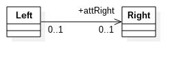
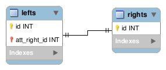
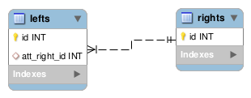
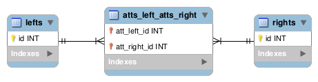

author: Kukulkan Team
summary: JPA en Kukulkan
id: doc-grammar-jpa-on-kukulkan
categories: documentation
environments: js
status: draft
analytics account: 0

# Relationships with JPA

## OneToOne Unidirectional

### UML
 *Unidirectional OneToOne UML relationship*

### Kukulkan Grammar

```java
    entity Left {
        OneToOne attRight: Right
    }
    entity Right {}
```

### Data Model
 *Unidirectional OneToOne Data Model*

*Foreign Keys*:   
- From `lefts` table to `rights` table: `fk_lefts.att_right_id_rights.id`


### Java (POJO)

```java
    @Entity
    @Table(name = "lefts")
    public class Left implements Serializable {
        private static final long serialVersionUID = 1L;

        @Id
        @GeneratedValue(strategy = GenerationType.IDENTITY)
        @Column(name = "id", unique = true, nullable = false)
        private Long id;

        @OneToOne
        @JoinColumn(name = "att_right_id", unique = true)
        private Right attRight;

        public Long getId() {
            return id;
        }

        public void setId(Long id) {
        this.id = id;
        }

        public Right getAttRight() {
            return attRight;
        }

        public void setAttRight(Right attRight) {
            this.attRight = attRight;
        }

    }

    @Entity
    @Table(name = "rights")
    public class Right implements Serializable {
        private static final long serialVersionUID = 1L;

        @Id
        @GeneratedValue(strategy = GenerationType.IDENTITY)
        @Column(name = "id", unique = true, nullable = false)
        private Long id;

        public Long getId() {
            return id;
        }

        public void setId(Long id) {
        this.id = id;
        }

    }
```


## OneToMany Unidirectional

### UML
 *Unidirectional OneToMany UML relationship*

Unsupported!  
The Left entity must always be navigable from Right entity.  
This case will be the **same as Bidirectional OneToMany**  

## ManyToOne Unidirectional

### UML
 *Unidirectional ManyToOne UML relationship*

### Kukulkan Grammar

```java
    entity Left {
        ManyToOne attRight: Right
    }
    entity Right {}
```

### Data Model
 *Unidirectional ManyToOne Data Model*

*Foreign Keys*:   
- From `lefts` table to `rights` table: `fk_lefts.att_right_id_rights.id`

### Java (POJO)

```java
    @Entity
    @Table(name = "lefts")
    public class Left implements Serializable {
        private static final long serialVersionUID = 1L;

        @Id
        @GeneratedValue(strategy = GenerationType.IDENTITY)
        @Column(name = "id", unique = true, nullable = false)
        private Long id;

        @ManyToOne
        @JoinColumn(name = "att_right_id")
        private Right attRight;

        public Long getId() {
            return id;
        }

        public void setId(Long id) {
        this.id = id;
        }

        public Right getAttRight() {
            return attRight;
        }

        public void setAttRight(Right attRight) {
            this.attRight = attRight;
        }

    }

    @Entity
    @Table(name = "rights")
    public class Right implements Serializable {
        private static final long serialVersionUID = 1L;

        @Id
        @GeneratedValue(strategy = GenerationType.IDENTITY)
        @Column(name = "id", unique = true, nullable = false)
        private Long id;

        public Long getId() {
            return id;
        }

        public void setId(Long id) {
        this.id = id;
        }

    }
```

## ManyToMany Unidirectional

### UML
 *Unidirectional ManyToMany UML relationship*

### Kukulkan Grammar

```java
    entity Left {
        ManyToMany attsRight: Right
    }
    entity Right {}
```

### Data Model
 *Unidirectional ManyToMany Data Model*

*Foreign Keys*:   
- From `lefts_atts_right` table to `lefts` table:  `fk_lefts_atts_right.left_id_lefts.id`
- From `lefts_atts_right` table to `rights` table: `fk_lefts_atts_right.att_right_id.rights.id`

### Java (POJO)

```java
    @Entity
    @Table(name = "lefts")
    public class Left implements Serializable {
        private static final long serialVersionUID = 1L;

        @Id
        @GeneratedValue(strategy = GenerationType.IDENTITY)
        @Column(name = "id", unique = true, nullable = false)
        private Long id;

        @ManyToMany
        @JoinTable(name = "lefts_atts_right", 
        joinColumns = JoinColumn(name="left_id", referencedColumnName="id"),
        inverseJoinColumns = 
        @JoinColumn(name="att_right_id", referencedColumnName="id"))
        private Set<Right> attsRight = new HashSet<>();

        public Long getId() {
            return id;
        }

        public void setId(Long id) {
        this.id = id;
        }

        public Set<Right> getAttsRight() {
            return attsRight;
        }

        public void setAttsRight(Set<Right> attsRight) {
            this.attsRight = attsRight;
        }

        public Left addAttRight (Right attsRight) {
            this.attsRight.add(attsRight);
            attsRight.getLeft().add(this);
            return this;
        }

        public Left removeAttRight(Right attsRight) {
            this.attsRight.remove(attsRight);
            attsRight.getLeft().remove(this);
            return this;
        } 

    }

    @Entity
    @Table(name = "rights")
    public class Right implements Serializable {
        private static final long serialVersionUID = 1L;

        @Id
        @GeneratedValue(strategy = GenerationType.IDENTITY)
        @Column(name = "id", unique = true, nullable = false)
        private Long id;

        public Long getId() {
            return id;
        }

        public void setId(Long id) {
            this.id = id;
        } 

    }
```

## OneToOne Bidirectional

### UML
 *Bidirectional OneToOne UML relationship*

### Kukulkan Grammar

```java        
    entity Left {
        OneToOne (attLeft) attRight: Right
    }
    entity Right {}
```

### Data Model
 *Bidirectional OneToOne Data Model*

*Foreign Keys*:   
- From `lefts` table to `rights` table: `fk_lefts.att_right_id_rights.id`

### Java (POJO)

```java
    @Entity
    @Table(name = "lefts")
    public class Left implements Serializable {
        private static final long serialVersionUID = 1L;

        @Id
        @GeneratedValue(strategy = GenerationType.IDENTITY)
        @Column(name = "id", unique = true, nullable = false)
        private Long id;

        @OneToOne
        @JoinColumn(name = "att_right_id", unique = true)
        private Right attRight;

        public Long getId() {
            return id;
        }

        public void setId(Long id) {
        this.id = id;
        }

        public Right getAttRight() {
            return attRight;
        }

        public void setAttRight(Right attRight) {
            this.attRight = attRight;
        }

    }

    @Entity
    @Table(name = "rights")
    public class Right implements Serializable {
        private static final long serialVersionUID = 1L;

        @Id
        @GeneratedValue(strategy = GenerationType.IDENTITY)
        @Column(name = "id", unique = true, nullable = false)
        private Long id;

        @OneToOne(mappedBy = "attRight")
        private Left attLeft;

        public Long getId() {
            return id;
        }

        public void setId(Long id) {
        this.id = id;
        }    
        
        public Left getAttLeft() {
            return attLeft;
        }

        public void setAttLeft(Left attLeft) {
            this.attLeft = attLeft;
        }

    }
```

## OneToMany Bidirectional

### UML
 *Bidirectional OneToMany UML relationship*

### Kukulkan Grammar

```java
    entity Left {
        OneToMany (attLeft) attsRight: Right
    }
    entity Right {}
```

### Data Model
 *Bidirectional OneToMany Data Model*

*Foreign Keys*:   
- From `rights` table to `lefts` table: `fk_rights.att_left_id_lefts.id`

### Java (POJO)

```java
    @Entity
    @Table(name = "lefts")
    public class Left implements Serializable {
        private static final long serialVersionUID = 1L;

        @Id
        @GeneratedValue(strategy = GenerationType.IDENTITY)
        @Column(name = "id", unique = true, nullable = false)
        private Long id;

        @OneToMany(mappedBy = "attLeft")
        @JsonIgnore
        private Set<Right> attsRight = new HashSet<>();

        public Long getId() {
            return id;
        }

        public void setId(Long id) {
        this.id = id;
        }

        public Set<Right> getAttsRight() {
            return attsRight;
        }

        public void setAttsRight(Set<Right> attsRight) {
            this.attsRight = attsRight;
        }

        public Left addAttRight (Right attRight) {
            this.attsRight.add(attRight);
            attRight.getLeft().add(this);
            return this;
        }

        public Left removeAttRight(Right attRight) {
            this.attsRight.remove(attRight);
            attRight.getLeft().remove(this);
            return this;
        } 

    }

    @Entity
    @Table(name = "rights")
    public class Right implements Serializable {
        private static final long serialVersionUID = 1L;

        @Id
        @GeneratedValue(strategy = GenerationType.IDENTITY)
        @Column(name = "id", unique = true, nullable = false)
        private Long id;

        @ManyToOne
        @JoinColumn(name = "att_left_id")
        private Left attLeft;

        public Long getId() {
            return id;
        }

        public void setId(Long id) {
        this.id = id;
        }    
        
        public Left getAttLeft() {
            return attLeft;
        }

        public void setAttLeft(Left attLeft) {
            this.attLeft = attLeft;
        }

    }
```

## ManyToOne Bidirectional

### UML
 *Bidirectional ManyToOne UML relationship*

### Kukulkan Grammar

```java        
    entity Left {
        ManyToOne (attsLeft) attRight: Right
    }
    entity Right {}
```

### Data Model
 *Bidirectional ManyToOne Data Model*

*Foreign Keys*:   
- From `lefts` table to `rights` table: `fk_lefts.att_right_id_rights.id`

### Java (POJO)

```java
    @Entity
    @Table(name = "lefts")
    public class Left implements Serializable {
        private static final long serialVersionUID = 1L;

        @Id
        @GeneratedValue(strategy = GenerationType.IDENTITY)
        @Column(name = "id", unique = true, nullable = false)
        private Long id;

        @ManyToOne
        @JoinColumn(name = "att_right_id")
        private Right attRight;

        public Long getId() {
            return id;
        }

        public void setId(Long id) {
        this.id = id;
        }

        public Right getAttRight() {
            return attRight;
        }

        public void setAttRight(Right attRight) {
            this.attRight = attRight;
        }

    }

    @Entity
    @Table(name = "rights")
    public class Right implements Serializable {
        private static final long serialVersionUID = 1L;

        @Id
        @GeneratedValue(strategy = GenerationType.IDENTITY)
        @Column(name = "id", unique = true, nullable = false)
        private Long id;

        @OneToMany(mappedBy = "attRight")
        private Set<Left> attsLeft = new HashSet<>();

        public Long getId() {
            return id;
        }

        public void setId(Long id) {
        this.id = id;
        }	    
        
        public Set<Left> getAttsLeft() {
            return attsLeft;
        }

        public void setAttsLeft(Set<Left> attsLeft) {
            this.attsLeft = attsLeft;
        }

    }
```

## ManyToMany Bidirectional

### UML
 *Bidirectional ManyToMany UML relationship*

### Kukulkan Grammar

```java
    entity Left {
        ManyToMany (attsLeft) attsRight: Right
    }
    entity Right {}
```

### Data Model
 *Bidirectional ManyToMany Data Model*

*Foreign Keys*:   
- From `atts_left_atts_right` table to `lefts` table:  `fk_atts_left_atts_right.att_left_id_lefts.id`
- From `atts_left_atts_right` table to `rights` table: `fk_atts_left_atts_right.att_right_id.rights.id`

### Java (POJO)

```java
    @Entity
    @Table(name = "lefts")
    public class Left implements Serializable {
        private static final long serialVersionUID = 1L;

        @Id
        @GeneratedValue(strategy = GenerationType.IDENTITY)
        @Column(name = "id", unique = true, nullable = false)
        private Long id;

        @ManyToMany
        @JoinTable(name = "atts_left_atts_right", 
        joinColumns = JoinColumn(name="att_left_id", referencedColumnName="id"),
        inverseJoinColumns = 
        @JoinColumn(name="att_right_id", referencedColumnName="id"))
        private Set<Right> attsRight = new HashSet<>();

        public Long getId() {
            return id;
        }

        public void setId(Long id) {
        this.id = id;
        }

        public Set<Right> getAttsRight() {
            return attsRight;
        }

        public void setAttsRight(Set<Right> attsRight) {
            this.attsRight = attsRight;
        }

        public Left addAttRight (Right attsRight) {
            this.attsRight.add(attsRight);
            attsRight.getLeft().add(this);
            return this;
        }

        public Left removeAttRight(Right attsRight) {
            this.attsRight.remove(attsRight);
            attsRight.getLeft().remove(this);
            return this;
        } 

    }

    @Entity
    @Table(name = "rights")
    public class Right implements Serializable {
        private static final long serialVersionUID = 1L;

        @Id
        @GeneratedValue(strategy = GenerationType.IDENTITY)
        @Column(name = "id", unique = true, nullable = false)
        private Long id;

        @ManyToMany(mappedBy = "attsRight")
        @JsonIgnore
        private Set<Left> attsLeft = new HashSet<>();

        public Long getId() {
            return id;
        }

        public void setId(Long id) {
        this.id = id;
        }

        public Set<Left> getLefts() {
            return attsLeft;
        }

        public void setLefts(Set<Left> attsLeft) {
            this.attsLeft = attsLeft;
        }

        public Right addLeft(Left left) {
            this.attsLeft.add(left);
            left.getAttsRight().add(this);
            return this;
        }

        public Right removeLeft(Lefts left) {
            this.lefts.remove(left);
            lefts.getAttsRight().remove(this);
            return this;
        }  

    }
```
