author: Kukulkan Team
summary: Introducción a Kukulkan
id: intro-kukulkan
categories: documentation
environments: js
status: draft
analytics account: 0

# Introducción a Kukulkan

## Introducción

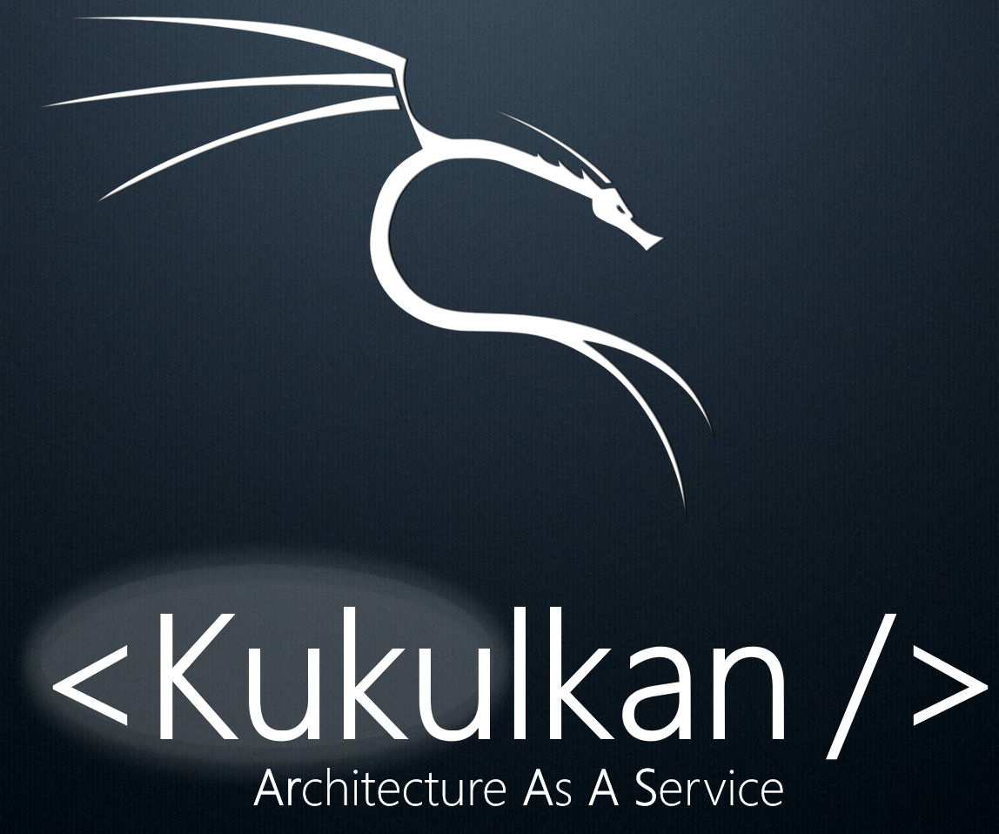

## Arquitectura - I

#### Arquitectura Roadmap

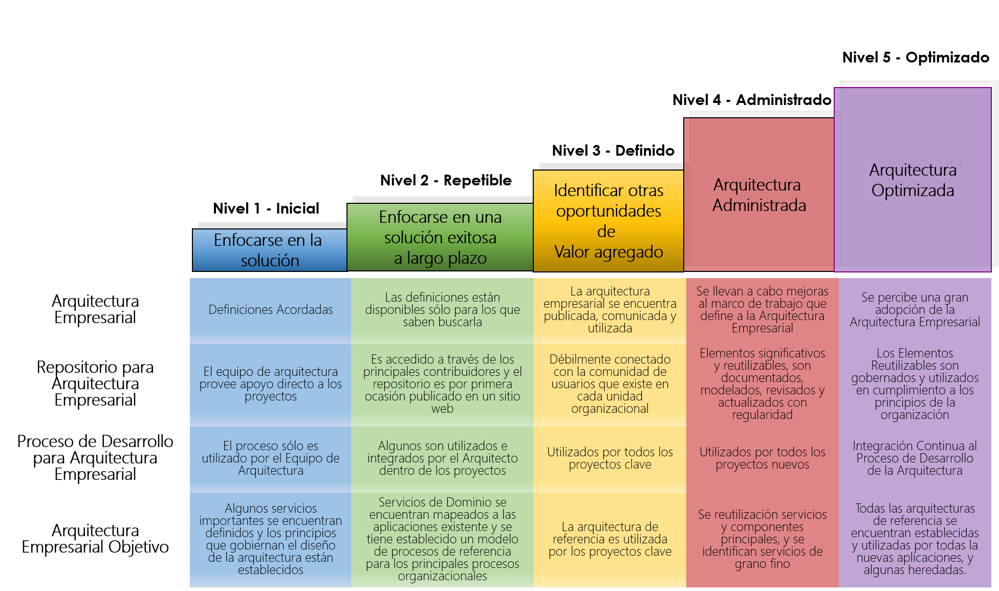

## Arquitectura - II

#### Arquitectura, nivel deseado

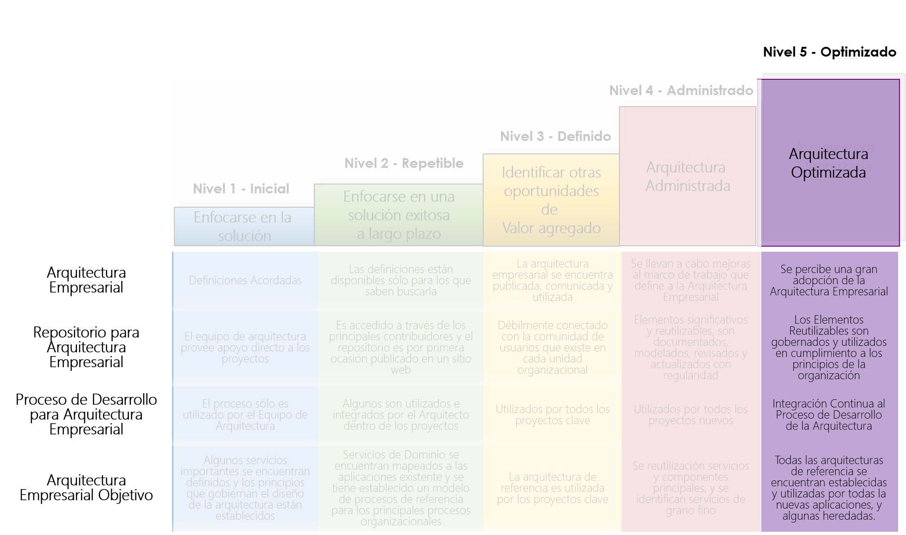

## Entendimiento I

#### Plano Mental

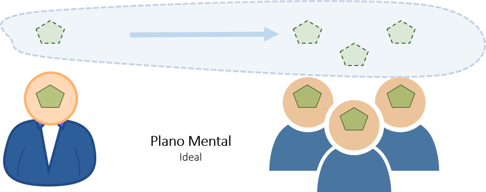

## Entendimiento II

#### Plano Físico


## Curva de Entendimiento

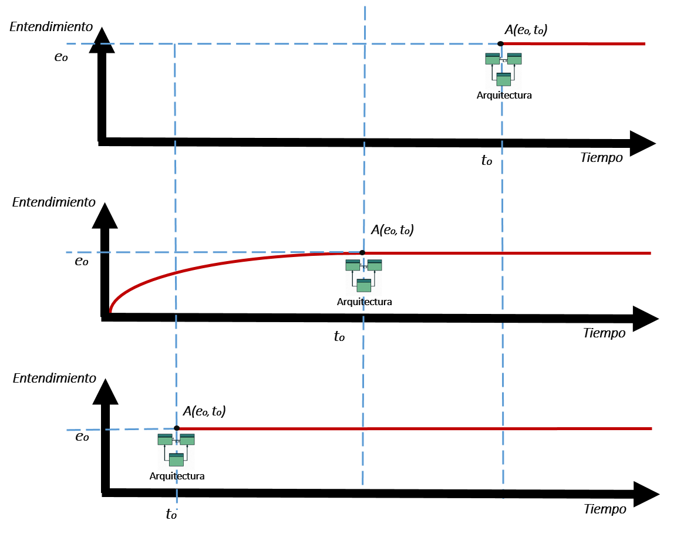

## Ciclo tradicional

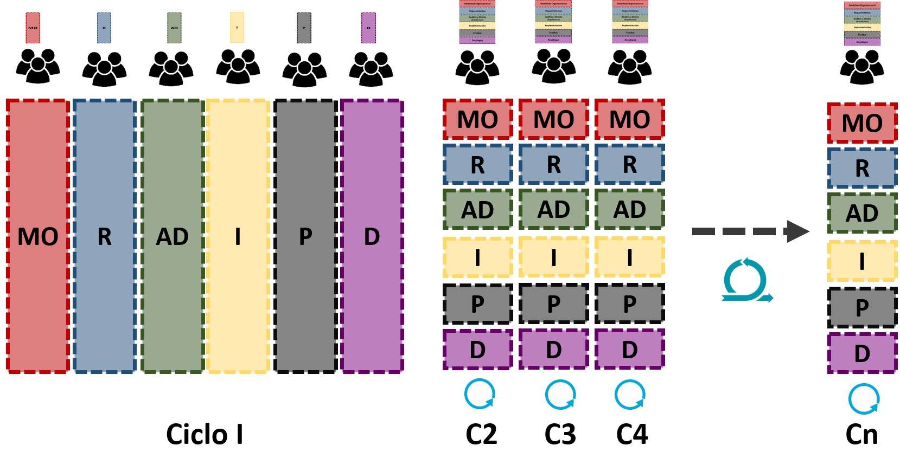

## Ciclo con kukulkan

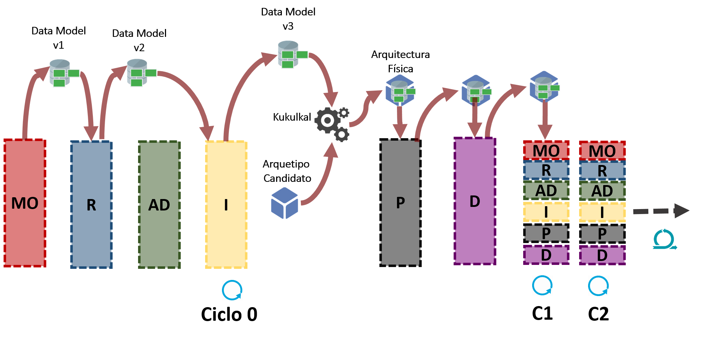

## Modelo de Reutilización


## Herramientas para Reutilizar


## KDM - Mínimo

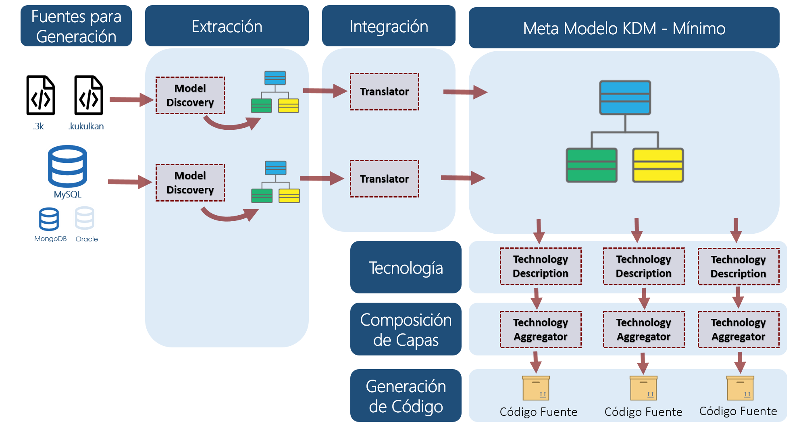

## Despliegue de la solución

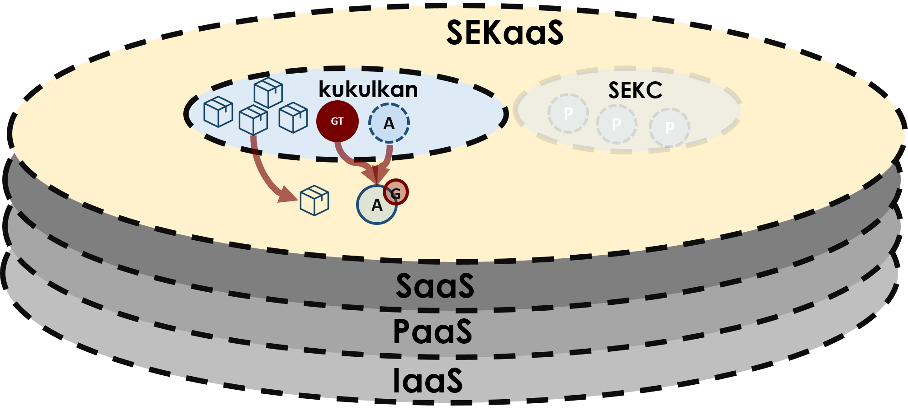

## Modelo de Distribución - Shell


## Modelo de Distribución - IDE


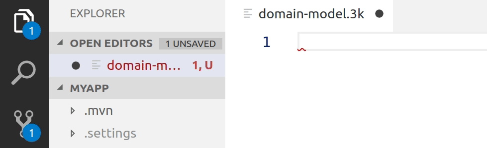

## Tecnologías Soportadas

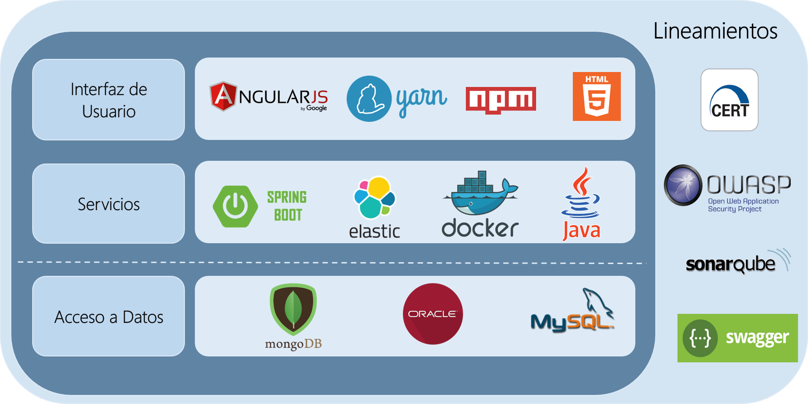

## Implantación de Proyectos

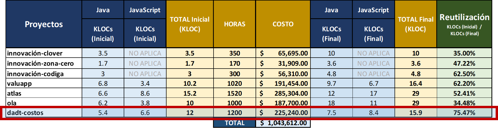


## Creación de un proyecto

Positive
: Para conectarse al servicio de kukulkan, se deberá utilizar la interfaz shell 

```bash
create-project --app-name ateb --database-type SQL_MYSQL --packaging mx.ateb.sales
config ---type FRONT_END
run
```

El resultado se muestra a continuación:


## Entidades a partir de Base de Datos

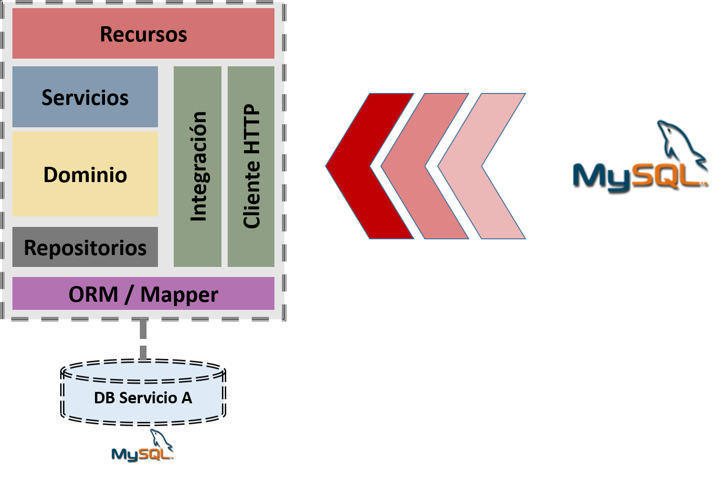


```shell
add-entities-from-database --source SQL_MYSQL

[Se proporcionan las credenciales para la conexión a la base de datos]

```

## Entidades a partir del Lenguaje Kukulkan

Positive
: Para desarrollor desde cero, se puede crear y editar el archivo model.3k, a partir del cual se define el modelo de dominio del sistema

```java
// Nombre del archivo: model.3k
// Se crea la entidad persona con 'usuarios' como nombre de la tabla en la base de datos
entity Persona (usuarios) {
    -> nombre : String required min(3) max(50),
    edad : Integer min(5) max(120) required,
    sueldo : Long,
    impuesto : Float,
    activo : Boolean,
    fechaCreacion : LocalDate,
    foto : ImageBlob,
    ManyToOne manager : Persona,
    ManyToMany proyectos : Proyecto,
    OneToMany retardos : Retardo,
    OneToOne user: CoreUser
}

entity Proyecto {
    nombre : String required,
    descripcion : String
}

entity Retardo {
    descripcion : String,
    fecha : LocalDate
}

views {
    Proyecto as Sheet
}
```


```bash
add-entities-from-language --file-name model.3k
```

Ejecutando la aplicación web:  

```bash
run
```

Use el siguiente comando para matar el proceso:  

```bash
stop-process --id [ID_DEL_PROCESO]
```

## Medir la Calidad del Código Generado


### Utilizar sonar con docker

```bash
docker-start --container-id [id_docker_sonar]
```

### Ejecutar el análisis de código

```bash
sonar
```

### Ver los resultados

```bash
http://localhost:9000
```

## Adición de un chatbot

```bash
add-chatbot --url-web-socket wss://chatbot-archetype.herokuapp.com
config ---type FRONT_END
run
```
